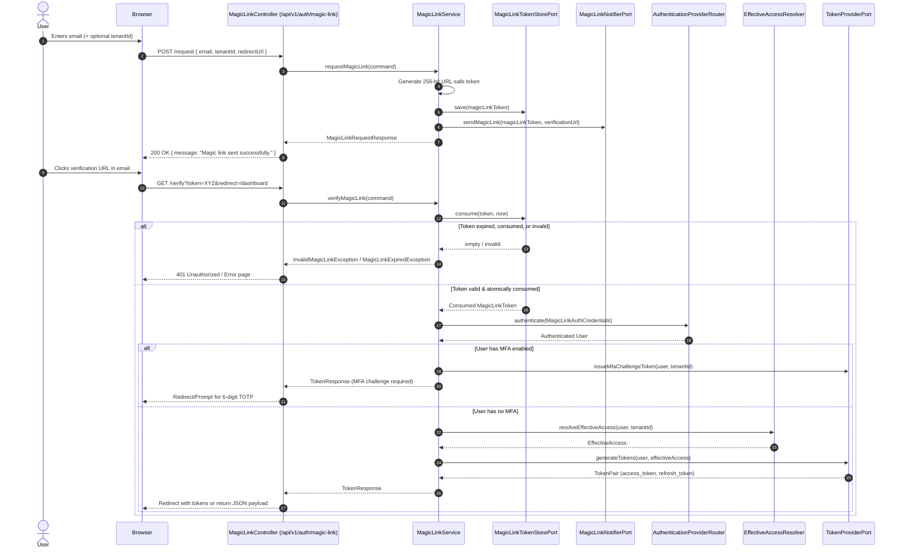

# 05. Magic Link & Passwordless Authentication Guide

This guide details the architecture, cryptographic mechanics, and API lifecycle of the **Passwordless Email Magic Link** authentication subsystem in `ed-iam`.

---

## 1. Overview & Architecture Standards

`ed-iam` delivers passwordless authentication via one-time cryptographically secure magic links following strict hexagonal architecture principles:

* **Pure Domain Kernel (`ed-iam-core`)**: Zero third-party library dependencies. Domain models (`MagicLinkToken`, `MagicLinkId`, `MagicLinkAuthCredentials`) and use-case contracts (`ManageMagicLinkUseCase`) are pure Java records enforcing invariants with compact constructors.
* **Cryptographically Secure Tokens**: Magic link tokens are generated using a 256-bit entropy source (`java.security.SecureRandom`) and encoded into URL-safe unpadded Base64 strings.
* **Single-Use Atomic Invalidation**: To eliminate replay attacks and race conditions, token consumption is executed atomically in persistent storage (`UPDATE ... WHERE token = :token AND consumed_at IS NULL AND expires_at > :now`).
* **Multi-Tenant Context Preservation**: When a user requests a magic link with a specific `TenantId`, that tenant context is stored alongside the token and preserved upon verification, correctly resolving tenant-scoped effective access and permissions.
* **MFA Interception**: If a user has enrolled in Multi-Factor Authentication (TOTP), magic link verification satisfies the primary identity factor and yields an `MfaChallengeToken`, prompting the user for their 6-digit TOTP code before granting final access.

---

## 2. Authentication Lifecycle & Flow



---

## 3. Core Domain & SPI Architecture

The magic link subsystem adheres strictly to hexagonal port & adapter boundaries:

### Inbound Ports (`io.github.edmaputra.iam.application.port.in`)
* `ManageMagicLinkUseCase`:
  * `requestMagicLink(MagicLinkRequestCommand command)`: Generates and dispatches a magic link token.
  * `verifyMagicLink(MagicLinkVerifyCommand command)`: Atomically consumes the token and returns JWT access tokens or an MFA challenge.
* `MagicLinkRequestCommand`: Immutable record containing `email`, optional `tenantId`, and optional `redirectUrl`.
* `MagicLinkVerifyCommand`: Immutable record containing `token`.

### Outbound SPI Ports (`io.github.edmaputra.iam.application.port.out`)
* `MagicLinkTokenStorePort`:
  * `save(MagicLinkToken token)`: Persists an issued magic link token.
  * `findByToken(String token)`: Retrieves a token by its raw string.
  * `consume(String token, Instant now)`: Atomically marks the token as consumed if valid and unexpired.
* `MagicLinkNotifierPort`:
  * `sendMagicLink(MagicLinkToken token, String verificationUrl)`: Dispatches the link via email, SMS, or notification bus.

---

## 4. Adapters & Storage Implementations

### A. Persistent JPA Adapter (`ed-iam-management`)
For production deployments, `JpaMagicLinkTokenStoreAdapter` connects to the relational database using Spring Data JPA.

Table Schema (`iam_magic_link_token`):
```sql
CREATE TABLE iam_magic_link_token (
    id VARCHAR(36) PRIMARY KEY,
    token VARCHAR(255) NOT NULL UNIQUE,
    user_id VARCHAR(36) NOT NULL,
    tenant_id VARCHAR(36),
    email VARCHAR(255) NOT NULL,
    expires_at TIMESTAMP WITH TIME ZONE NOT NULL,
    consumed_at TIMESTAMP WITH TIME ZONE,
    created_at TIMESTAMP WITH TIME ZONE NOT NULL
);
CREATE INDEX idx_magic_link_token ON iam_magic_link_token(token);
CREATE INDEX idx_magic_link_user_id ON iam_magic_link_token(user_id);
```

### B. In-Memory Adapter (`ed-iam-auth`)
For testing, microservices without relational databases, or local development, `InMemoryMagicLinkTokenStore` provides a thread-safe, `ConcurrentHashMap`-backed token store with atomic CAS updates.

### C. Logging Notifier Adapter (`ed-iam-auth`)
`LoggingMagicLinkNotifier` serves as the default fallback notifier, printing the generated magic link to `INFO` logs. Production applications can replace this with an `EmailService` bean implementing `MagicLinkNotifierPort`.

---

## 5. Configuration & Properties Reference

Configure magic link behavior under `iam.auth.magic-link` in `application.yml`:

```yaml
iam:
  auth:
    magic-link:
      enabled: true                  # Whether passwordless magic link auth is active (default: true)
      expiration-seconds: 900        # Validity duration in seconds (default: 900s = 15 minutes)
      base-url: "http://localhost:8080" # Base application URL used to construct the verification link
```

---

## 6. REST API Endpoints

### 1. Request Magic Link
* **Endpoint**: `POST /api/v1/auth/magic-link/request`
* **Access**: Public
* **Request Body**:
  ```json
  {
    "email": "doctor@metro.org",
    "tenantId": "metro-hospital",
    "redirectUrl": "http://localhost:8080/dashboard"
  }
  ```
* **Response**: `200 OK`
  ```json
  {
    "message": "If an account matching that email exists, a sign-in link has been sent to your inbox."
  }
  ```

### 2. Verify Magic Link (REST API / SPA)
* **Endpoint**: `POST /api/v1/auth/magic-link/verify`
* **Access**: Public
* **Request Body**:
  ```json
  {
    "token": "z_BTX9q4cCL6cZdlq-Z95iNGl1U8D8KTwUinIihHZ9E"
  }
  ```
* **Response**: `200 OK` (standard `TokenResponse`):
  ```json
  {
    "accessToken": "eyJhbGciOi...",
    "refreshToken": "eyJhbGciOi...",
    "tokenType": "Bearer",
    "expiresIn": 3600,
    "user": {
      "id": "...",
      "username": "doctor",
      "email": "doctor@metro.org",
      "activeTenantId": "metro-hospital"
    }
  }
  ```

### 3. Verify Magic Link (Direct Browser Click)
* **Endpoint**: `GET /api/v1/auth/magic-link/verify?token=XYZ&redirect=/dashboard`
* **Access**: Public
* **Behavior**:
  * Consumes token atomically.
  * If valid, returns JSON or redirects to the requested `redirect` URL with tokens encoded as URL parameters.
  * If invalid/expired, returns `401 ProblemDetail`.

---

## 7. Testing & Interactive Playground

The `samples/ed-iam-playground` application includes a dedicated **Passwordless Magic Link** panel:

1. Launch Playground:
   ```bash
   ./mvnw spring-boot:run -pl samples/ed-iam-playground
   ```
2. Navigate to `http://localhost:8080`.
3. Locate the **"Passwordless Magic Link"** card.
4. Select a demo persona (e.g. `doctor@metro.org`), click **"Dispatch Magic Link"**.
5. The console and UI display the generated verification URL.
6. Click **"Simulate Link Click"** or copy the URL into your browser to log in without entering a password.
